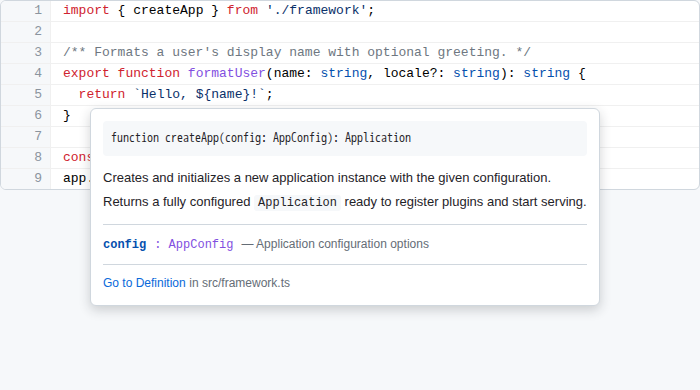
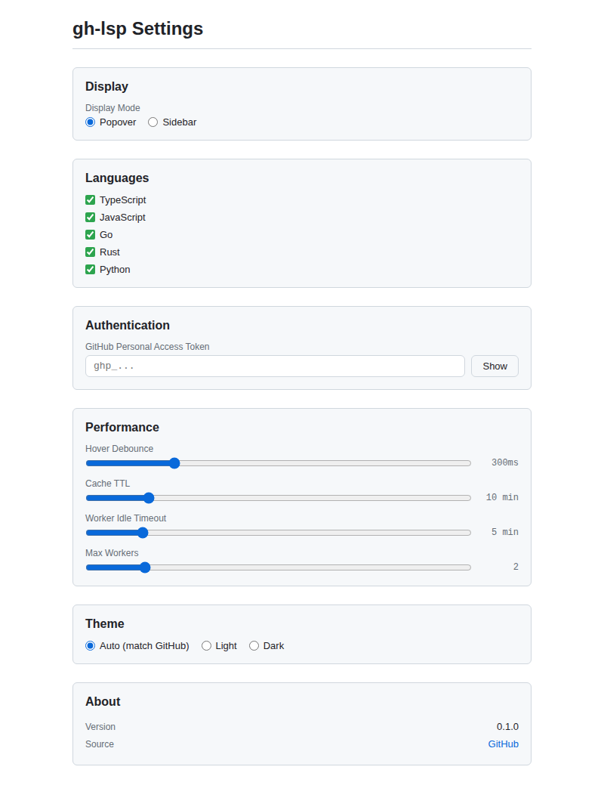
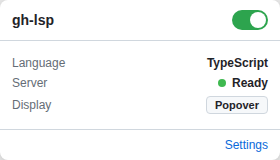

# gh-lsp

IDE-level hover info, go-to-definition, and signature help on GitHub.com — powered by WebAssembly language servers running in your browser.

## Install

**Chrome Web Store** (coming soon)

**Manual install:** Download the latest `.zip` from [Releases](https://github.com/nadilas/gh-lsp/releases), unzip it, then load it in `chrome://extensions` with Developer Mode enabled.

## Usage

Hover over any symbol on a GitHub code page to see type info, documentation, and a link to the definition.

| Shortcut | Action |
|----------|--------|
| `Alt+Shift+L` | Toggle extension on/off |
| `Alt+Shift+S` | Toggle sidebar panel |
| `Alt+Shift+P` | Pin current popover |

Options & Popup

| | |
|---|---|
|  |  |

## Supported Languages

TypeScript, JavaScript, Go, Rust, Python

## GitHub PAT (optional)

For higher API rate limits, add a Personal Access Token in the extension options page.

## License

[MIT](LICENSE)
